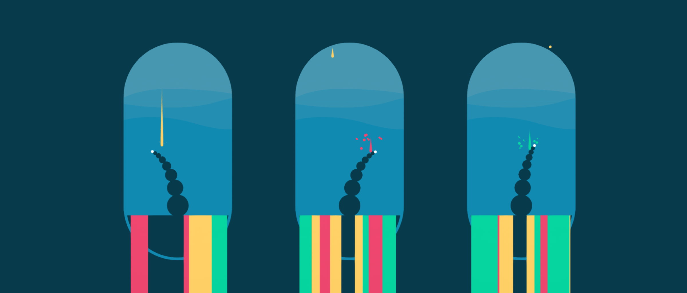

# touch of the void

This game was developed within 3 hours for [trijam 93](https://itch.io/jam/trijam-93), a three hour game jam. The three hour limit includes production only, meaning the time used for submission and coming up with an idea is exempt.

The game is hosted on [itch.io](https://daniellanner.itch.io/touch-of-the-void) and playable in the browser. The entire thing is made with Unity and my collection of tools Coterie.

## controls

Move your mouse left and right to curl and uncurl the tentacle. Shooting stars that hit the ground color in the world. Decide which stars to let pass and which ones to catch to color the world to your desire. This is a zen experience, you cannot win or lose. Put on your headphones and relax for a minute.

## notes

The project was build using Unity 2018.4.27f LTS and should run out of the box.

Due to the time limit the visual style and some programming is very simplistic. Anyway, give it a try on itch and if you'd like to feel better about *your* code, feel free to check out the bones of this hacked together project.

